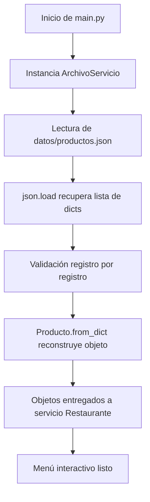
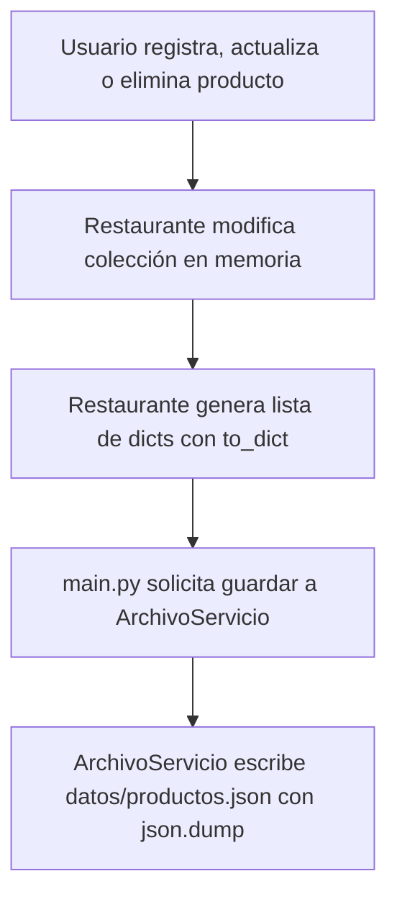

# restaurante_app — Semana 10: Persistencia JSON, Excepciones y Modularidad

## Descripción General
Este proyecto corresponde a la **Semana 10** de la asignatura *Programación Orientada a Objetos*. Constituye la evolución del sistema `restaurante_app`, incorporando la **persistencia de datos de productos mediante un archivo JSON externo** (`datos/productos.json`), un servicio dedicado para operaciones de almacenamiento (`servicios/archivo_servicio.py`), y un exhaustivo **manejo de excepciones** para garantizar la estabilidad de la aplicación.

---

## Arquitectura del Proyecto

El sistema mantiene una arquitectura modular con separación clara de responsabilidades:

```
restaurante_app/
├── datos/
│   └── productos.json          # Archivo de persistencia de productos
├── modelos/
│   ├── __init__.py             # Exposición del paquete modelos
│   ├── producto.py             # Clase Producto, validaciones, to_dict() y from_dict()
│   └── usuario.py              # Clase Usuario (permanece en memoria)
├── servicios/
│   ├── __init__.py             # Exposición del paquete servicios
│   ├── archivo_servicio.py     # Servicio I/O para JSON y manejo de excepciones de archivos
│   └── restaurante.py          # Servicio de gestión de colecciones en memoria
├── main.py                     # Coordinador de interfaz de consola y flujos
└── README.md                   # Documentación de la Semana 10
```

---

## Responsabilidad de cada Componente

1. **`modelos/producto.py` (`Producto`)**:
   - Representa la entidad de dominio de un producto.
   - Aplica encapsulamiento con getters y setters para validar código, nombre, categoría y precio.
   - `to_dict()`: Convierte el objeto en un diccionario listo para serializar en JSON.
   - `@classmethod from_dict()`: Reconstruye un objeto `Producto` a partir de un diccionario, validando la presencia de las claves requeridas.

2. **`modelos/usuario.py` (`Usuario`)**:
   - Representa a un usuario del sistema (cédula/ID, nombre, correo).
   - Administrado en memoria durante esta semana.

3. **`servicios/archivo_servicio.py` (`ArchivoServicio`)**:
   - Encargado exclusivo de leer (`json.load`) y escribir (`json.dump`) el archivo `datos/productos.json`.
   - Utiliza `with open()` y codificación `UTF-8`.
   - Concentra el manejo de excepciones de archivos (`FileNotFoundError`, `json.JSONDecodeError`, `PermissionError`).

4. **`servicios/restaurante.py` (`Restaurante`)**:
   - Administra las colecciones en memoria (`List[Producto]` y `List[Usuario]`).
   - Implementa operaciones de registro, búsqueda por código, actualización, eliminación y listado.
   - Desacoplado por completo de la consola y de los detalles físicos de almacenamiento.

5. **`main.py`**:
   - Punto de entrada de la aplicación.
   - Instancia `ArchivoServicio` y carga la lista de diccionarios al iniciar.
   - Reconstruye los objetos `Producto` utilizando `from_dict()` y los entrega a `Restaurante`.
   - Coordina el menú por consola e invoca a `ArchivoServicio` para actualizar `productos.json` tras operaciones que modifiquen la colección.

---

## Flujos de Carga y Guardado

### Flujo de Carga (Inicio del Sistema)


### Flujo de Guardado (Modificación de Productos)


---

## Estrategia de Manejo de Excepciones

El sistema contempla y controla las siguientes situaciones excepcionales de forma específica:

| Excepción | Situación Controlada | Acción / Comportamiento |
| :--- | :--- | :--- |
| `FileNotFoundError` | El archivo `productos.json` no existe en la primera ejecución. | Se inicia la aplicación normalmente con una colección vacía. |
| `json.JSONDecodeError` | El archivo `productos.json` existe pero contiene un formato inválido o está corrupto. | Notifica el error en consola y permite iniciar con colección vacía sin detener la app. |
| `PermissionError` | No existen permisos de lectura o escritura en el disco. | Notifica el problema al usuario y evita el colapso del sistema. |
| `KeyError` | Un registro del JSON almacenado carece de alguna clave obligatoria (`codigo`, `nombre`, `categoria`, `precio`). | Omite únicamente el registro corrupto e informa en consola, manteniendo los demás productos. |
| `ValueError` | Un valor no cumple las validaciones (precio <= 0, campos vacíos, o entrada no numérica por consola). | Se muestra un mensaje explicativo y se solicita corregir el valor. |

---

## Guía de Comprobación de Persistencia

Para verificar el correcto funcionamiento de la persistencia real y el control de excepciones, realice la siguiente prueba:

1. **Primera Ejecución**:
   ```bash
   python main.py
   ```
   - Verifique que la aplicación inicia correctamente informando que `datos/productos.json` no existe o está listo para iniciar.

2. **Registro de Productos**:
   - Seleccione la opción `1. Registrar producto`.
   - Ingrese un código (e.g. `P001`), nombre (`Hamburguesa Especial`), categoría (`Platos`) y precio (`8.50`).
   - Verifique en consola el mensaje `[PERSISTENCIA] Archivo 'productos.json' actualizado correctamente.`.

3. **Verificación en Disco**:
   - Abra el archivo `datos/productos.json` y confirme que contiene el registro en formato JSON indentado.

4. **Reinicio de la Aplicación**:
   - Seleccione la opción `8. Salir del sistema`.
   - Ejecute nuevamente `python main.py`.
   - Seleccione la opción `5. Listar productos`.
   - Confirme que el producto `P001` fue recuperado exitosamente del archivo JSON.

5. **Prueba de Actualización y Eliminación**:
   - Actualice el precio del producto `P001` mediante la opción `3`.
   - Elimine un producto con la opción `4`.
   - Cierre y reinicie la aplicación para confirmar que las modificaciones perduran en el archivo `productos.json`.
