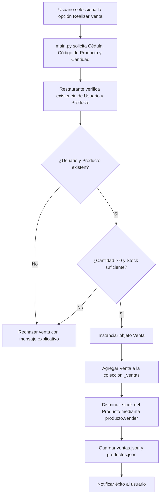

# restaurante_app — Semana 11: Colecciones, Relaciones, Ventas y Persistencia JSON

**Estudiante:** Jasmin Ramirez  
**Asignatura:** Programación Orientada a Objetos (POO) — 2do. Semestre  
**Parcial:** 2 | **Semana:** 11  

---

## 📋 Descripción General del Sistema

El sistema `restaurante_app` evoluciona en la **Semana 11** para aplicar de forma integral los conceptos de **colecciones de objetos, relaciones entre entidades, control de stock y persistencia completa en archivos JSON**.

En esta versión:
1. **Producto** gestiona la cantidad disponible en almacén (`stock`) evitando valores negativos.
2. **Usuario** amplía sus funcionalidades permitiendo persistencia física completa en `usuarios.json`.
3. **Venta** se incorpora como una nueva entidad de dominio que representa de forma explícita la relación entre un `Usuario` y un `Producto` adquirido.
4. **Restaurante** (Servicio) coordina las colecciones en memoria, controla las reglas de negocio (validación de stock, existencia de entidades) y realiza consultas filtradas de ventas por usuario.
5. **ArchivoServicio** centraliza la lectura (`json.load`) y escritura (`json.dump`) de los archivos `productos.json`, `usuarios.json` y `ventas.json`, garantizando el manejo transparente de excepciones físicas de archivos.

---

## 📁 Estructura del Proyecto

```
restaurante_app/
├── datos/
│   ├── productos.json          # Almacena el catálogo de productos y su stock actualizado
│   ├── usuarios.json           # Almacena los usuarios registrados en el sistema
│   └── ventas.json             # Almacena las transacciones realizadas (Usuario -> Producto)
├── modelos/
│   ├── __init__.py             # Exposición del paquete modelos
│   ├── producto.py             # Clase Producto (validaciones, stock, vender(), to_dict, from_dict)
│   ├── usuario.py              # Clase Usuario (validaciones, to_dict, from_dict)
│   └── venta.py                # Clase Venta (relación usuario_id, producto_codigo, cantidad)
├── servicios/
│   ├── __init__.py             # Exposición del paquete servicios
│   ├── archivo_servicio.py     # Servicio I/O para JSON y manejo de excepciones de archivos
│   └── restaurante.py          # Servicio de gestión de colecciones y reglas de negocio
├── main.py                     # Coordinador de interfaz de consola y flujo principal
└── README.md                   # Documentación técnica completa de la Semana 11
```

---

## ⚙️ Responsabilidad de cada Componente

| Componente | Archivo | Responsabilidad Principal (SRP) |
| :--- | :--- | :--- |
| **`Producto`** | [`modelos/producto.py`](file:///c:/Users/LENOVO/Desktop/PROGRAMACION%20ORIENTADA%20O%20OBJETOS%20%28C%29%202do.%20Sem/2626-POO-JASMIN-RAMIREZ/PARCIAL%202/SEMANA%2011/restaurante_app/modelos/producto.py) | Entidad de dominio que representa los datos de un producto, valida atributos, gestiona el `stock`, disminuye inventario con `vender()` y permite conversión `to_dict()` y `from_dict()`. |
| **`Usuario`** | [`modelos/usuario.py`](file:///c:/Users/LENOVO/Desktop/PROGRAMACION%20ORIENTADA%20O%20OBJETOS%20%28C%29%202do.%20Sem/2626-POO-JASMIN-RAMIREZ/PARCIAL%202/SEMANA%2011/restaurante_app/modelos/usuario.py) | Entidad de dominio que representa un usuario registrado (ID, nombre, correo). Incorpora `to_dict()` y `from_dict()` para su persistencia física. |
| **`Venta`** | [`modelos/venta.py`](file:///c:/Users/LENOVO/Desktop/PROGRAMACION%20ORIENTADA%20O%20OBJETOS%20%28C%29%202do.%20Sem/2626-POO-JASMIN-RAMIREZ/PARCIAL%202/SEMANA%2011/restaurante_app/modelos/venta.py) | Entidad de dominio que materializa la relación entre un usuario y un producto (`usuario_id`, `producto_codigo`, `cantidad`). |
| **`ArchivoServicio`** | [`servicios/archivo_servicio.py`](file:///c:/Users/LENOVO/Desktop/PROGRAMACION%20ORIENTADA%20O%20OBJETOS%20%28C%29%202do.%20Sem/2626-POO-JASMIN-RAMIREZ/PARCIAL%202/SEMANA%2011/restaurante_app/servicios/archivo_servicio.py) | Encargado exclusivo de leer y escribir en disco los archivos JSON (`productos.json`, `usuarios.json`, `ventas.json`) controlando excepciones de archivo. |
| **`Restaurante`** | [`servicios/restaurante.py`](file:///c:/Users/LENOVO/Desktop/PROGRAMACION%20ORIENTADA%20O%20OBJETOS%20%28C%29%202do.%20Sem/2626-POO-JASMIN-RAMIREZ/PARCIAL%202/SEMANA%2011/restaurante_app/servicios/restaurante.py) | Servicio que administra las colecciones de objetos en memoria (`_productos`, `_usuarios`, `_ventas`), ejecuta la validación de stock y la búsqueda/filtrado de ventas por usuario. |
| **`main.py`** | [`main.py`](file:///c:/Users/LENOVO/Desktop/PROGRAMACION%20ORIENTADA%20O%20OBJETOS%20%28C%29%202do.%20Sem/2626-POO-JASMIN-RAMIREZ/PARCIAL%202/SEMANA%2011/restaurante_app/main.py) | Punto de entrada del programa. Presenta el menú interactivo, reconstruye objetos al inicio y solicita a `ArchivoServicio` el guardado tras operaciones en `Restaurante`. |

---

## 🛒 Relación Principal: Usuario + Producto → Venta

Una venta representa la interacción real en el restaurante entre una persona registrada y un producto disponible.

```
┌─────────────────┐        ┌──────────────────┐
│     Usuario     │        │     Producto     │
│ (identificacion)│        │     (codigo)     │
└────────┬────────┘        └────────┬─────────┘
         │                          │
         └──────────┐    ┌──────────┘
                    ▼    ▼
             ┌─────────────────┐
             │      Venta      │
             │ - usuario_id    │
             │ - prod_codigo   │
             │ - cantidad      │
             └─────────────────┘
```

### Flujo de Ejecución de una Venta (`vender_producto`)


---

## 📦 Funcionamiento del Stock

Cada objeto `Producto` maneja su propiedad `stock`.
- **Validación inicial/modificación:** El setter de `stock` impide valores negativos.
- **Descuento de inventario:** El método `vender(cantidad)` descuenta unidades solo si la cantidad solicitada es válida ($>0$) y menor o igual al stock disponible.
- **Ejemplo:**
  - Stock inicial: 10 unidades.
  - Venta solicitada: 2 unidades $\rightarrow$ Venta exitosa $\rightarrow$ Nuevo stock: 8 unidades.
  - Venta solicitada posterior: 15 unidades $\rightarrow$ Rechazada por stock insuficiente $\rightarrow$ Stock se mantiene en 8 unidades.

---

## 💾 Persistencia de Datos (Archivos JSON)

La aplicación almacena y recupera las tres colecciones del sistema mediante serialización y deserialización de objetos.

```
  [ OBJETOS ]  ──(to_dict)──>  [ DICCIONARIOS ]  ──(json.dump)──>  [ Archivo .json ]

  [ Archivo .json ]  ──(json.load)──>  [ DICCIONARIOS ]  ──(from_dict)──>  [ OBJETOS ]
```

- **`productos.json`**: Conserva productos y su stock actualizado tras registros, ediciones, eliminaciones o ventas.
- **`usuarios.json`**: Conserva los usuarios registrados en el sistema.
- **`ventas.json`**: Conserva el historial de transacciones que vinculan usuarios y productos.

---

## 🛡️ Manejo de Excepciones Controladas

El programa incluye control específico de errores para evitar fallos inesperados o pérdida de datos:

| Excepción | Contexto y Situación | Estrategia y Solución Aplicada |
| :--- | :--- | :--- |
| `FileNotFoundError` | Si alguno de los archivos JSON no existe en la carpeta `datos/`. | Se notifica en consola y se inicializa la colección correspondiente vacía `[]`. |
| `json.JSONDecodeError` | Si un archivo JSON posee sintaxis errónea o está corrupto. | Se despliega aviso descriptivo y se inicia con colección vacía para no colapsar la app. |
| `PermissionError` | Falta de permisos de lectura o escritura en el sistema operativo. | Se notifica al usuario en pantalla y se impide la interrupción abrupta del sistema. |
| `KeyError` | Si un registro leído del JSON carece de alguna clave requerida (`codigo`, `stock`, `identificacion`, etc.). | Se omite de forma individual el registro corrupto al cargar y se continúa con los demás. |
| `ValueError` | Validaciones de dominio (precio $\le 0$, stock $< 0$, entradas no numéricas o strings vacíos). | Capturado tanto en setters del modelo como en la interfaz de consola para solicitar correcciones. |

---

## 🚀 Forma de Ejecución

1. Abrir la terminal en el directorio del proyecto:
   ```bash
   cd "PARCIAL 2/SEMANA 11/restaurante_app"
   ```

2. Ejecutar el script principal:
   ```bash
   python main.py
   ```

---

## 🧪 Pruebas Realizadas (Comprobación de Funcionamiento)

Se llevaron a cabo las siguientes pruebas de verificación:

1. **Carga inicial limpia:**
   - Se inició la app sin archivos previos en `datos/`. El sistema notificó la ausencia de archivos y comenzó con colecciones vacías de forma transparente.

2. **Registro de Usuario y Producto:**
   - Se registró al usuario `0102030405` (Jasmin Ramirez).
   - Se creó el producto `P001` (Hamburguesa Especial, Precio: $8.50, Stock: 10).
   - Se confirmó la creación física de `usuarios.json` y `productos.json`.

3. **Operación de Venta Válida:**
   - Se vendieron 2 unidades de `P001` al usuario `0102030405`.
   - Se verificó que el stock de `P001` se redujo a `8`.
   - Se confirmó la actualización simultánea en `ventas.json` y `productos.json`.

4. **Consulta de Ventas por Usuario:**
   - Se utilizó la opción 9 (`Consultar ventas por usuario`) especificando la cédula `0102030405`. El sistema filtró e imprimió la venta registrada.

5. **Prueba de Persistencia Real (Reinicio):**
   - Se cerró el programa (Opción 11) y se volvió a ejecutar `python main.py`.
   - Se listaron productos, usuarios y ventas, confirmando que todos los objetos fueron reconstruidos exitosamente desde los archivos JSON.

6. **Rechazo por Stock Insuficiente:**
   - Se intentó vender 15 unidades de `P001` (sabiendo que solo quedaban 8).
   - El sistema rechazó la venta, emitió un mensaje explicativo y conservó intactos el stock y las colecciones.
